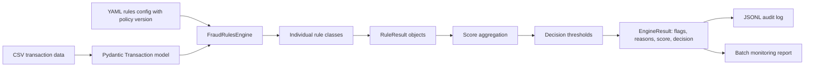

# Production Python Fraud Rules Engine

A production-style learning project for building a configurable fraud rules engine in Python.

## Business Problem

A BNPL company needs a transparent first-line fraud engine before sending risky orders to an ML model, manual review queue, or hard rejection policy. The engine evaluates incoming transactions and returns risk flags, reason codes, rule-level explanations, score contributions, a total risk score, and a final decision: `accept`, `review`, or `reject`.

This project intentionally avoids ML at first. In many real fintech systems, rules are still used because they are fast to deploy, easy to explain to Risk and Compliance teams, and useful as policy controls around ML models.

## Project Goal

Build a clean, testable, configurable Python package that applies business fraud rules to synthetic BNPL transactions. The design is simple enough to understand fully, but close enough to production patterns to discuss in Staff-level interviews.

## Architecture



## Setup

```bash
python -m venv .venv
source .venv/bin/activate
make install
```

## Generate Synthetic Data

```bash
make generate-data
```

This writes 100 deterministic synthetic BNPL transactions to `data/sample_transactions.csv`.

To choose a different number of rows, pass the number after the target:

```bash
make generate-data 50
```

## Run The Rule Engine

```bash
make run
```

This evaluates 100 transactions by default.

To evaluate a different number of transactions, pass the number after the target:

```bash
make run 34
```

Or call the CLI directly:

```bash
python -m fraud_rules_engine.cli --config config/rules.yaml --input data/sample_transactions.csv --limit 5
```

The CLI also writes:

- `reports/audit_log.jsonl`: one compact audit record per scored transaction.
- `reports/batch_report.json`: decision distribution, average score, and top fired rules.

## Run Tests And Linting

```bash
make test
make lint
```

## Run With Docker

Docker is useful when you want to run the project without relying on your local Python
environment. The image installs the package inside a clean Python 3.11 container.

Build the image:

```bash
make docker-build
```

Run the engine in the container:

```bash
make docker-run
```

This evaluates 100 transactions by default. To choose a different limit, pass the number
after the target:

```bash
make docker-run 10
```

The Docker target mounts your local `data/` directory into the container as read-only and
mounts your local `reports/` directory for outputs. This means:

- Run `make generate-data` first if `data/sample_transactions.csv` does not exist.
- Container runs still write `reports/audit_log.jsonl` and `reports/batch_report.json`
  on your machine.
- If you change Python code, rebuild the image with `make docker-build` before running it
  again.

Equivalent raw Docker commands:

```bash
docker build -t fraud-rules-engine .
docker run --rm \
  -v "$PWD/data:/app/data:ro" \
  -v "$PWD/reports:/app/reports" \
  fraud-rules-engine \
  --config config/rules.yaml \
  --input data/sample_transactions.csv \
  --limit 10
```

## Clean Generated Files

```bash
make clean
```

This removes generated data, reports, Python caches, test/lint caches, and local package metadata.

To also remove the virtual environment:

```bash
make clean-all
```

## Example Input Transaction

```json
{
  "transaction_id": "txn_0002",
  "customer_id": "cust_1002",
  "merchant_id": "merch_2002",
  "order_amount": 729.5,
  "merchant_category": "electronics",
  "merchant_risk_score": 0.82,
  "customer_tenure_days": 7,
  "number_previous_orders": 0,
  "previous_failed_payments": 0,
  "device_id": "dev_9002",
  "device_risk_score": 0.88,
  "email_domain": "temp-mail.org",
  "email_domain_risk": 0.91,
  "billing_shipping_distance_km": 318.0,
  "payment_method": "card",
  "country": "DE",
  "hour_of_day": 2
}
```

## Example Output Decision

```json
{
  "transaction_id": "txn_0002",
  "policy_version": "bnpl-fraud-rules-v1",
  "decision": "reject",
  "total_risk_score": 190,
  "risk_flags": [
    "high_order_amount",
    "high_merchant_risk_score",
    "new_customer_high_amount",
    "high_device_risk_score",
    "risky_email_domain",
    "large_billing_shipping_distance",
    "suspicious_transaction_time",
    "high_risk_merchant_category",
    "high_device_new_customer_high_amount"
  ],
  "reason_codes": [
    "HIGH_ORDER_AMOUNT",
    "HIGH_MERCHANT_RISK_SCORE",
    "NEW_CUSTOMER_HIGH_AMOUNT",
    "HIGH_DEVICE_RISK_SCORE",
    "RISKY_EMAIL_DOMAIN",
    "LARGE_BILLING_SHIPPING_DISTANCE",
    "SUSPICIOUS_TRANSACTION_TIME",
    "HIGH_RISK_MERCHANT_CATEGORY",
    "HIGH_DEVICE_NEW_CUSTOMER_HIGH_AMOUNT"
  ]
}
```

The full CLI output also includes every rule result, including rules that did not fire.
Reason codes are validated against the `ReasonCode` enum in `models.py`, so a rule cannot emit an unknown reason code by accident.

## Example Batch Monitoring Report

```json
{
  "policy_version": "bnpl-fraud-rules-v1",
  "transactions_scored": 10,
  "decision_counts": {
    "accept": 4,
    "review": 2,
    "reject": 4
  },
  "average_risk_score": 65.5,
  "top_fired_rules": {
    "high_risk_merchant_category": 4,
    "high_order_amount": 3
  }
}
```

This is intentionally simple, but it mirrors the kind of operational summary a Risk or Fraud team would inspect after a policy change.

## What I Should Learn From This Project

- How a transparent rule-based fraud system works before ML.
- How to separate domain models, configuration, rule logic, decision policy, and CLI execution.
- How configuration-driven thresholds let Risk teams change behavior without changing Python code.
- Why reason codes and explanations matter for fraud operations, credit risk, compliance, and customer support.
- How to think about the path from notebook code to reusable package code.
- How policy versioning, audit records, and batch monitoring make a risk system easier to govern.
- How Docker packages the project into a repeatable runtime environment.

## Personal Learning TODOs

- TODO: Add 3 new fraud rules.
- TODO: Write tests for those rules.
- TODO: Refactor the rule execution logic to make adding rules more extensible.
- TODO: Add one new decision threshold or policy layer.
- TODO: Add a policy comparison report for two config versions.
